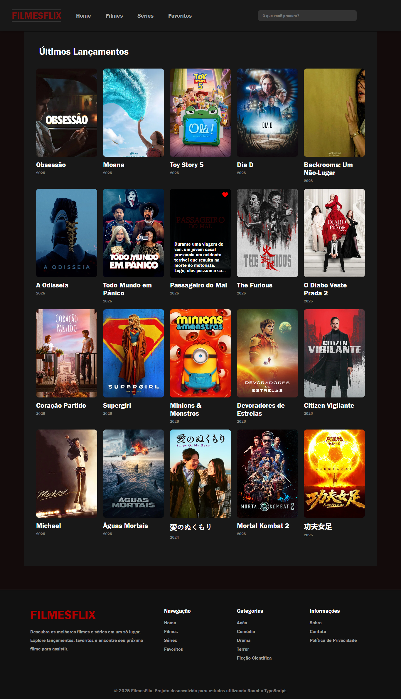

# 🎬 FilmesFLix

O FilmesFLix é uma aplicação desenvolvida com React e TypeScript que consome a API do TMDB para exibir filmes e séries populares. O projeto também permite pesquisar títulos e salvar seus favoritos utilizando o LocalStorage.

## 🚀 Funcionalidades

- Listagem de filmes populares
- Listagem de séries populares
- Pesquisa em tempo real
- Adicionar e remover favoritos
- Armazenamento dos favoritos no LocalStorage
- Layout responsivo para desktop e dispositivos móveis

## 🛠️ Tecnologias utilizadas

- React
- TypeScript
- React Router DOM
- CSS
- TMDB API
- LocalStorage
- React Icons


## 📸 Demonstração

Imagen do home do projeto

## 📷 Preview



## 📂 Estrutura do projeto

```
src
├── components
├── pages
├── services
├── types
├── App.tsx
└── main.tsx
```

## ⚙️ Como executar o projeto

Clone o repositório:

```bash
git clone https://github.com/italo-kaua/FilmesFLix.git
```

Acesse a pasta do projeto:

```bash
cd FilmesFLix
```

Instale as dependências:

```bash
npm install
```

Inicie o projeto:

```bash
npm run dev
```

## 🔑 Configuração da API

Este projeto utiliza a API do **The Movie Database (TMDB)**.

Crie uma conta no TMDB e gere sua chave de API.

Depois, configure sua chave no arquivo responsável pelas requisições.

## 📌 API utilizada

- https://www.themoviedb.org/
- https://developer.themoviedb.org/

## 📚 O que pratiquei neste projeto

- Componentização com React
- Tipagem com TypeScript
- Consumo de API utilizando Fetch
- Gerenciamento de estado com Hooks
- Rotas com React Router
- Manipulação do LocalStorage
- Responsividade com CSS
- Organização de pastas e reutilização de componentes

## 👨‍💻 Autor

Desenvolvido por **Ítalo Kauã**.

GitHub:
https://github.com/italo-kaua

